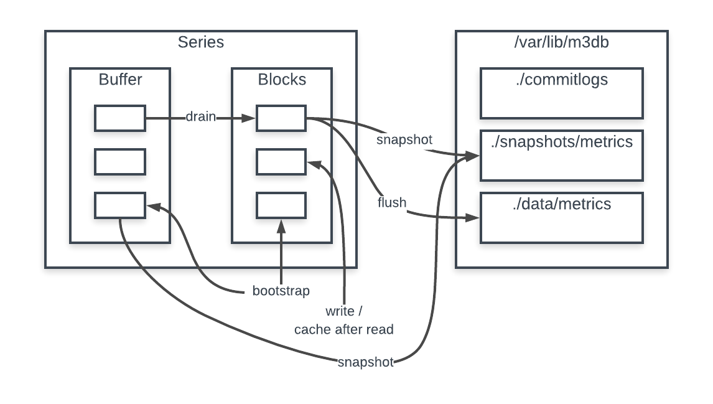
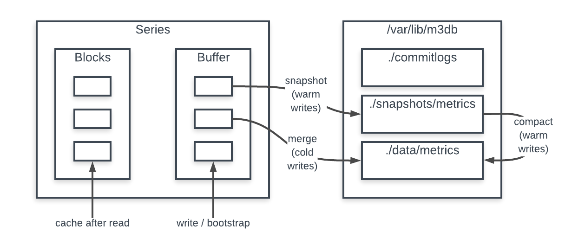

# Proposal: M3DB Writing To Any Time

Author(s): Justin Chan

Last updated: Thursday, December 6, 2018
Discussion at [github.com/m3db/proposal/issues/5](https://github.com/m3db/proposal/issues/5).

## Abstract

M3DB currently only accepts writes with timestamps that fall within a configurable duration before and after the current time. This prevents certain use cases, for example backfilling data and forecasting data. This document outlines a change that enables users to write data into M3DB with any timestamp within the retention period.

## Background

M3DB houses its metrics in the following hierarchy:

Database → namespaces → shards → series → blocks + buffer

Writes come into the buffer, which holds the mutable data within the series. Each write is persisted into a commit log for disaster recovery. In addition, [snapshots](https://docs.google.com/document/d/1wqke7CmGIznfBXf-dEWyqnJZROWQ1lQ83ChO3TXR0fU/edit) are taken of the entire mutable block and persisted as a snapshot file (structurally identical to data files) in the snapshot directory.

The series also has a blocks area, which contain the immutable data. After a block can no longer be written to, the contents of that block within the buffer are drained to blocks, where the flush cycle will eventually persist them on to disk as (compressed) data files.

Other ways in which data arrive at the series are via bootstrap or by getting cached after a read. The block to be bootstrapped will go to the buffer if there is a writable bucket within the buffer for it; otherwise it will be bootstrapped within the blocks. Finally, when we want to cache a block after reading data from disk, it will get cached within the blocks.

A summary of the data flow can be summarized by the below diagram:

In this document, I define *warm* writes as writes that fall within the configured window around the current time (writes that M3DB accept today). I define *cold* writes as any writes outside of that window.

## Proposal

The structure of the buffer will have to be modified in order to accommodate writes coming in with an arbitrary time. The buffer will be in charge of handling all the data requiring persistence, i.e. data that need to eventually be stored as data files. The blocks section will only be used as the area for caching. The new data flow will be:

1. Writes go into the buffer
2. For warm writes:
    1. Periodic snapshots capture warm writes in the series as it does today
    2. A compactor process will move the now complete snapshot to the data directory. For the majority of the time, since snapshots are essentially the same as data files, this will be a simple move operation. However, there could be an existing data file for this block already from a future write, in which case the compactor will merge it with the snapshot data before persisting
3. For cold writes:
    1. Every tick, the compactor will merge all cold writes with (potentially) existing data for the block and write it out as the new data file
4. After the persistence to disk is fully complete (snapshot for warm writes; merging to a data file for cold writes), the buffer will evict that data from memory and the cache for that block will be invalidated if present, since the disk now has more up to date data

A summary of the new data flow can be summarized by the below diagram:

## Rationale

While we expect M3DB’s most prevalent use case to remain as collecting current metrics, enabling writes for an arbitrary timestamp enables other use cases for M3DB. After talking to other users who were interested in this new proposal[[A]](#heading=h.4nmwr5b8r3vx), none of their use cases for cold writes had a usage pattern of sustained, high throughput writes. Thus, this informs us to design around maintaining high performance for our current workloads while making cold writes possible.

The current design revolves around the fact that after a certain time, blocks are sealed and any metric for that block (or before) can no longer be written to. Given that this will no longer be the case, we need to change the structure of data within the buffer and the data flow to disk.

Draining to the series blocks was done when that block is sealed, but since blocks can always be written to, draining no longer makes sense. Instead, we aim to have a better separation of concerns:

* The series blocks will be used just as the area to hold on to blocks for caching when reading from disk. This also simplifies the logic as to whether a block can be evicted. Furthermore, this avoids having to rewrite caching code, which works off of blocks and not buffer buckets.
* The series buffer will handle all data that require persistence to disk. New writes and bootstrapped blocks will go to the buffer, and snapshots/merges will happen directly in the buffer as well.

The compactor process in charge of merging new data with existing data from the data file will be necessary to support cold writes. Fileset files are immutable in that once a metric is written to disk, we no longer modify that file. If we want to persist new metrics at a time for which we already have a data file, we would need to either:

1. Write another file to contain them, compacting files later, or
2. Merge them with the data in the existing file and write the new complete file

After discussing solution (1), we settled on targeting (2) instead, which is simpler to implement and leaves the possibility of moving towards (1) at a later point to improve write performance of cold writes.

Warm writes should still account for the vast majority of use cases for M3DB, and as such, we should aim to optimize for the warm writes case. This solution should only have a nominal impact on performance for warm writes. The reason why cold writes are treated differently from warm writes is that there isn’t a logical time when we would want to persist them.

In the new flow, since there will still be at most be one active snapshot and one active data file, the read path does not need to change significantly.

## Implementation

**Series buffer/blocks**

We will need a map of buffer buckets to facilitate the ability to write to any time. We will add: 	

<pre>
type dbBuffer struct {
    opts           Options
    nowFn          clock.NowFn
    blockRetriever QueryableBlockRetriever

    <b>bucketsMap          map[xtime.UnixNano]*dbBufferBuckets</b>
    <b>bucketsCache        [bucketsCacheSize]*dbBufferBuckets</b>
    <b>bucketVersionsPool  *dbBufferBucketsPool</b>
    <b>bucketPool          *dbBufferBucketPool</b>

    blockSize             time.Duration
    bufferPast            time.Duration
    bufferFuture          time.Duration
    coldWritesEnabled     bool
    <b>futureRetentionPeriod time.Duration</b>
}
</pre>

bucketsMap maps a block start time to their corresponding buckets

bucketsCache is an LRU write cache to buckets so that map lookups are minimized for writes

The existing dbBufferBucket struct will have to be refactored. Metrics aren’t fully persisted to disk until persist operations for all series are complete at the shard level. This means that there will be a period between when e.g. a merge is complete for the series and when those new datapoints are actually retrievable from disk. The buffer must keep merged metrics in memory until they are retrievable, otherwise reads during that period would fail. It is important to separate (1) new writes during this period from (2) what has been (attempted to be) merged, otherwise we can’t safely evict (2) from memory without knowing that we’re not dropping metrics from (1). Hence, we introduce the concept of versions in buckets, increasing the bucket version when a merge is attempted, creating a new version 0 bucket to write to going forward. Encapsulating these versioned buckets for each dbBufferBucket is dbBufferBucketVersions.

<pre>
type dbBufferBucketVersions struct {
    buckets           []*dbBufferBucket
    start             time.Time
    opts              Options
    lastReadUnixNanos int64
    bucketPool        *dbBufferBucketPool
}
</pre>

<pre>
type dbBufferBucket struct {
    opts     Options
    start    time.Time
    encoders []inOrderEncoder
    blocks   []block.DatabaseBlock
    version  int
    wType    WriteType
}
</pre>

As an intermediate milestone, we should implement the above and verify the correctness and performance of warm writes before proceeding with the compactor and other changes. In order to facilitate this, we’d have to introduce a flush method for the buffer so that data can be flushed from the buffer directly.

**Compactor**

The Compactor will be an asynchronous process controlled via the mediator similar to flushing.

<pre>
Compact(
    ctx context.Context,
    blockStart time.Time,
    persistFn persist.DataFn,
) error
</pre>

This will merge snapshot files for a block start time with any existing data file for blockStart and persist it as the new data file. As part of persisting a data file, an info metadata file is also written, which contains the ID of the latest snapshot that we compacted. As part of manipulating files, we will also need to update and invalidate their file seekers appropriately such that new read attempts will only access the newly created data file. File seekers referencing outdated files will only be removed once all in-flight reads are satisfied.

**Clean up**

After a snapshot is compacted into a data file, it can be safely removed. To do this, we inspect the info metadata file to find the latest snapshot ID that has been compacted. That latest snapshot file and any previous snapshots for that block can safely be cleaned up. If there is no such metadata file, no snapshots for that block can be cleaned up.

## Open issues

* Due to the assumptions made in the index, there would have to be optimizations done in that area to make sure we take into account the possibility of cold writes.
* Naming of "metric type". Suggestions:
    * ~~Realtime / NonRealtime~~
    * Warm / Cold 
    * ~~Realtime / OutOfOrder~~
    * ~~Active / Passive~~

## Future Work

**Unifying Metric Persistence**

In the future, we may also want to consider merging the two persistence strategies for warm and cold writes into the single data flow of: write to buffer → snapshot → compact/merge to data file. This will require coming up with heuristics as to when snapshots should be compacted and merged, as well as additional work to be able to handle multiple active snapshot files, but may be worth it to unify data flows.

**Client For Batch Emission**

With the current design, it would be suboptimal from a memory and CPU usage perspective for the client to emit a batch of metrics in random chronological order. This will cause the creation of additional buckets to then be flushed and GC’d. To mitigate this, a client can be built that handles the data to be backfilled, ensuring that they are in chronological order and potentially hinting to M3DB when a good time to snapshot/compact would be.

## Appendix A

**Use Case 1:** Backfilling

There are a few reasons why User wants to be able backfill:
1. To migrate from existing metrics platform to M3
2. A processing pipeline goes down and metrics get queued up. After the pipeline recovers, there may be metrics from hours/days old to batch process
3. After developing a new feature, there may be metrics for that feature that need to be backfilled

**Use Case 2:** Forecasting

Metrics will need to be emitted for a future time to support forecasting. This will not be a high throughput metric emission.

**Use Case 3:** Batch Processing

Some metrics will require substantial offline calculation from current data before that metric can be emitted. This will cause metric emissions to have up to an hour in delay.

**Use Case 4:** Metric Corrections

Rewriting a metric for the same series for the same timestamp will cause that metric to be overwritten by the new metric. There are times when metrics need to be corrected, following a bug fix or other business requirement change.
